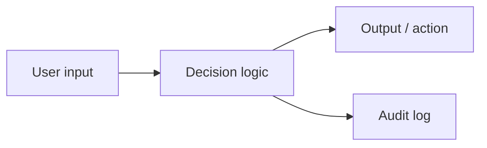

# ROUND-PLAN — Round [N]: [problem title]

Copy this file to `ROUND-PLAN.md` for each new round. Replace all bracketed placeholders, write the problem and architecture before coding, and update the remaining sections as the demo takes shape.

- **Round start:** [local date, time, and timezone]
- **Demo owner:** [name]
- **Builders:** [names and responsibilities]
- **Core loop:** [input] → [decision] → [output]

## 1. Problem (2–3 sentences)

[What emergency-response failure does this fix? Write this before any code.]

## 2. Architecture

[Under 8 boxes. Name the core loop: input → decision → output.]

## 3. Demo script (90 seconds)

1. [Click 1]
2. [Click 2 — the "aha" moment: what changes for the decision-maker]
3. [Click 3]

## 4. Tradeoffs (what we chose NOT to build, and why)

- [Cut X] because [reason — time, judging signal, demo risk]
- [Cut Y] because [reason]

## 5. Smoke tests (3–5 max, demo path only)

Run `uv run pytest -x -q` at minutes 30 and 38. Check items only after verification.

- [ ] `test_demo_happy_path` — the exact click path above, green
- [ ] `test_api_rejects_bad_input`
- [ ] [one more on the demo path]

**Demo command:** [exact command to launch the app]

**Demo URL:** [local URL to open]

**Required configuration:** [environment variable names or "none"; never include secrets]

## 6. What we'd do with 4 more hours

[One paragraph — shows judges the vision without costing round time.]
