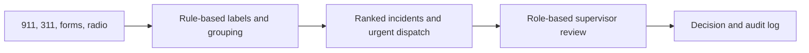

# ROUND-PLAN — Round 3: Incident Twin

- **Round start:** 2026-10-07, active work session (America/New_York)
- **Demo owner:** TBD
- **Builders:** TBD
- **Core loop:** multi-channel reports → rule-based incident grouping and triage → supervisor review and dispatch decision

## 1. Problem

During a call surge, dispatchers can receive many reports about the same moving incident while missing urgent details or confusing nearby unrelated emergencies. Incident Twin groups reports into explainable incidents, sends critical reports immediately, and gives a supervisor the final say on proposed groupings.

## 2. Architecture

## 3. Demo script (90 seconds)

1. Load 14 demo calls as Dispatcher. **Aha:** show 14 reports grouped into 3 incidents.
2. Open the stolen vehicle incident and show its footprint from 86th to 96th Street.
3. Show the separate cardiac emergency marked Sent now, despite being nearby.
4. Try Approve as Dispatcher (blocked), then flag the grouping.
5. Switch to Dispatch supervisor, review and approve; show the log.

## 4. Tradeoffs

- Use deterministic rules and seeded reports instead of an LLM or live feeds so every grouping is explainable and the demo is repeatable.
- Use a simple street/avenue block distance instead of a map service.
- Let a matching vehicle continue a moving incident beyond the 2-block category-match radius to preserve the supplied 86th-to-96th Street seed outcome; category-only matches stay within 2 blocks.
- Keep units as a small in-memory pool; the supervisor approves a draft, while actual CAD integration is out of scope.

## 5. Smoke tests

- [x] `test_demo_groups_into_three_incidents`
- [x] `test_cardiac_stays_separate_and_dispatches_now`
- [x] `test_fight_is_consequence_of_car_incident`
- [x] `test_only_supervisor_can_decide`
- [x] `test_api_rejects_bad_input`

**Demo command:** `uv run flask --app round3.app:app run --debug` (from the repository root)

**Demo URL:** `http://127.0.0.1:5000`

**Required configuration:** none

**Verification:** `uv run pytest -x -q` from `round3/` — 5 passed. Local Flask smoke check returned the page at `/` and loaded 14 reports into 3 incidents.

## 6. What we'd do with 4 more hours

Connect authenticated dispatch feeds, validate grouping quality with supervisors using replayed incidents, and add a map-backed location model and a controlled CAD handoff after human approval.
