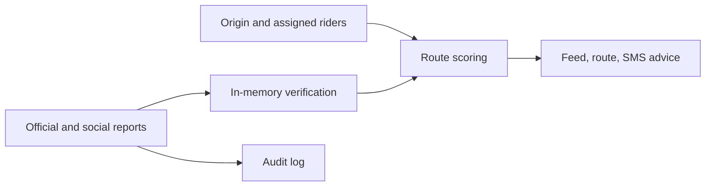

# ROUND-PLAN — Round 2: Get Me Home NYC

- **Round start:** 2026-10-07, active work session (America/New_York)
- **Demo owner:** TBD
- **Builders:** TBD
- **Core loop:** official and social reports + origin → closure verification and load-balanced routing → route advice and audit log

## 1. Problem

During a parade, flood, or blackout, a transit closure or crowd surge can strand people trying to get home. Get Me Home NYC turns official alerts and privacy-preserving social reports into a verified feed and safer station recommendations, and stays off outside a declared event window.

## 2. Architecture

## 3. Demo script (90 seconds)

1. Activate a parade event and request a route from MSG.
2. Report one social signal for 34 St-Penn Station; show that it is only reported and routing stays the same.
3. **Aha:** add an NYPD report for Penn; it becomes confirmed and the recommended route flips.

## 4. Tradeoffs

- Use seeded station loads and in-memory reports because this is a short, reproducible demo.
- Do not connect to live city, transit, social, or SMS services; the demo focuses on verification and routing behavior.
- Keep the feed off by default and retain only social place names to reduce exposure and avoid stale public guidance.

## 5. Smoke tests

- [x] `test_feed_off_by_default`
- [x] `test_demo_happy_path`
- [x] `test_api_rejects_bad_input`
- [x] `test_deactivate_deletes_social`

**Demo command:** `uv run uvicorn round2.app:app --reload`

**Demo URL:** `http://127.0.0.1:8000`

**Required configuration:** none

**Verification:** `uv run pytest -x -q` — 4 passed. The documented curl flow was also run against a local Uvicorn server; the route changed from Penn to Herald Sq after the NYPD report.

## 6. What we'd do with 4 more hours

Connect official alert and transit crowding feeds, add expiry and provenance handling for reports, and pilot the recommendations with city emergency managers before sharing routes publicly.
